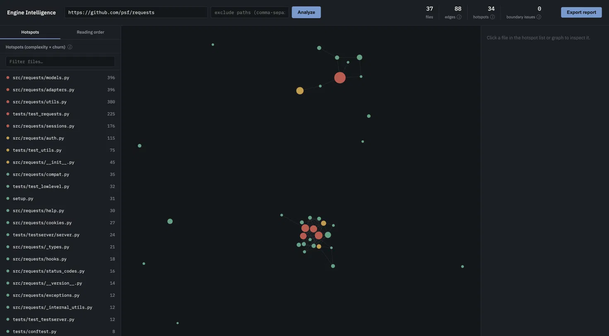
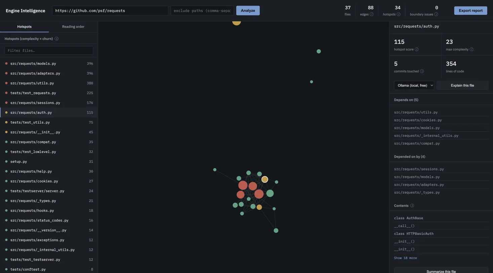
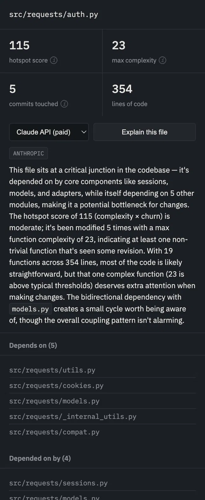
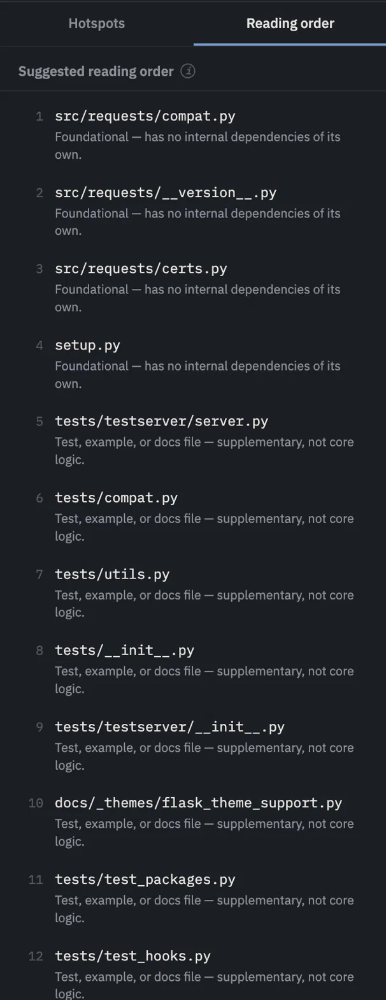

# Engine Intelligence

**A codebase analysis tool that tells a new engineer which files are actually risky to touch, and in what order to read through an unfamiliar codebase, using evidence from the code's structure and git history, not guesswork.**

**Live demo:** https://engine-intelligence.vercel.app
**Repo:** https://github.com/jaitotla/engine-intelligence

## What it does

Point it at any public GitHub repo (or a local path) and it:

* **Parses the code.** Python via its AST, JavaScript/TypeScript via tree-sitter, to map out which files depend on which.
* **Mines git history.** Finds files that change often, and files that change together even when they don't import each other.
* **Scores risk.** Combines complexity and churn into a ranked hotspot list.
* **Visualizes it.** An interactive dependency graph (node size is file size, color is risk) with a per file drill down panel for every node.
* **Generates a reading order.** A topological sort through the codebase, so you never get told to read a file before something it depends on.
* **Explains it in plain English, on demand.** Click any file to get an AI explanation grounded strictly in the computed metrics, or a separate summary that reads the actual source.

## Why I built it

During my first week at my internship this summer, I struggled to get oriented in the team's codebase. There was too much to review and no clear place to start, and even after my mentor walked me through it, I still couldn't tell how files actually connected or which ones were safe to touch. Engine Intelligence is the tool I wished existed. Instead of "here's the repo, good luck," it gives a new engineer a ranked, evidence based starting point.

## How it works: 5 phases

1. **AST parsing and dependency graph.** Parses every file and resolves imports into a real dependency graph. Python resolves by dotted module path; JS/TS resolves by filesystem path (relative imports, extension guessing, `index` file resolution). Two structurally different resolution systems, merged into one graph.
2. **Git history mining.** Walks commit history to compute per file churn, and to find files that repeatedly change together in the same commits even when there's no import relationship between them. That second signal is something the dependency graph alone can't see.
3. **Technical debt scoring.** Hotspot score equals complexity times churn. Deliberately not times coupling. An early version multiplied all three together and found it zeroed out real hotspots that had no coupling data, so hotspot score and coupling are reported as two separate signals instead. Also computes boundary violations, meaning code crossing between parts of the codebase that are supposed to be architecturally separate.
4. **Interactive UI.** A force directed dependency graph, a sortable hotspot list, a suggested reading order, and a per file drill down panel, all built in React.
5. **LLM layer.** An "Explain" feature that reasons only from computed metrics (it is never shown the source, so it can't invent claims about behavior), and a separate "Summarize" feature that does read the source. The two are kept deliberately distinct so it's always clear which kind of claim you're looking at. Supports both a local Ollama model (free) and the Claude API (paid, higher quality).

## Screenshots









## Tech stack

**Backend:** Python, FastAPI, Python's `ast` module, tree-sitter (pinned to a compatible version), GitPython style git log parsing via `subprocess`

**Frontend:** React, Vite, D3 force (dependency graph visualization), react markdown

**AI:** Anthropic Claude API, Ollama (local models)

**Deployment:** Render (backend), Vercel (frontend)

**Testing:** pytest, 26 tests covering real bugs found during development: import resolution in both languages, module boundary detection, reading order correctness, the exclude patterns feature, and a performance regression.

## Known limitations

Documented honestly rather than hidden.

* Only Python, JS, JSX, TS, and TSX are supported. No Jupyter notebooks (code is stored as JSON, not plain source) and no other languages.
* Circular dependencies have no single valid reading order. Files caught in a dependency cycle, which is common in mature codebases, are grouped at the end of the reading order and ranked by how many files depend on them, since no genuinely safe first file exists among them.
* File summaries on large files are based on a truncated view of the source (the first roughly 12,000 characters), plus a complete structural outline generated separately so the summary still knows about classes and functions it couldn't fully read. It may still describe things only at the level the outline supports, not with full certainty.
* The live demo only supports the Claude API option, not Ollama. Ollama runs on your own machine, which a hosted server has no way to reach.
* Repos analyzed via the live demo are capped at roughly 5,000 source files and a 500 commit clone depth, purely to keep the shared free tier instance responsive for every visitor. This is not a cost control measure.

## Running it locally

See [SETUP.md](./SETUP.md) for full install, run, and deployment instructions, including a couple of real environment specific gotchas: a `tree-sitter` version pin, and a `python -m uvicorn` PATH issue on machines with both Anaconda and a venv installed.

```bash
git clone https://github.com/jaitotla/engine-intelligence.git
cd engine-intelligence
pip install -r requirements.txt
cd api && python -m uvicorn main:app --port 8000
```

```bash
cd frontend
npm install
npm run dev
```
